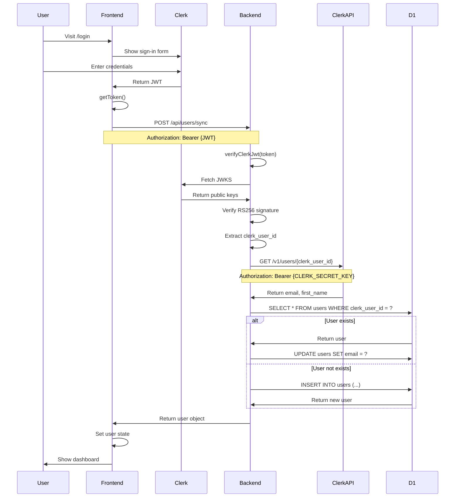

# InLinkr Clerk Authentication Audit

**Date:** July 19, 2026  
**Repository:** RobertBolgar/inlinkr-platform  
**Scope:** TubeLinkr → InLinkr platform authentication migration  

---

## Executive Summary

TubeLinkr currently uses Clerk for authentication with a development-auth bypass enabled. The authentication system is well-structured with clear separation between frontend and backend concerns. The current Clerk application is configured for `.clerk.accounts.dev` (development) and will need to be migrated to production before supporting `app.inlinkr.com`.

**Key Finding:** The current Clerk application cannot support `app.inlinkr.com` in its current state because:
1. It uses the development Clerk backend (`.clerk.accounts.dev`)
2. The allowed domains are configured for `tubelinkr.com` (not `app.inlinkr.com`)
3. A production Clerk application with proper domain configuration is required

**Recommendation:** Create a new production Clerk application for the InLinkr platform with `app.inlinkr.com` as the primary domain.

---

## 1. Authentication Architecture Overview

### 1.1 Current Flow

```
┌─────────────────┐
│   User Browser  │
└────────┬────────┘
         │
         │ 1. Visit /login or /signup
         ▼
┌─────────────────────────────────┐
│  ClerkProvider (Frontend)       │
│  - @clerk/clerk-react           │
│  - VITE_CLERK_PUBLISHABLE_KEY   │
└────────┬────────────────────────┘
         │
         │ 2. Clerk Auth Flow
         ▼
┌─────────────────────────────────┐
│  Clerk Hosted Auth              │
│  - Sign In / Sign Up            │
│  - Returns JWT                   │
└────────┬────────────────────────┘
         │
         │ 3. JWT Token
         ▼
┌─────────────────────────────────┐
│  AuthContext (Frontend)         │
│  - Calls POST /api/users/sync   │
│  - Authorization: Bearer {JWT}   │
└────────┬────────────────────────┘
         │
         │ 4. Sync Request
         ▼
┌─────────────────────────────────┐
│  auth-helper.js (Backend)       │
│  - verifyClerkJwt()             │
│  - CLERK_JWKS_URL validation    │
│  - RS256 signature verification │
└────────┬────────────────────────┘
         │
         │ 5. Fetch from Clerk API
         ▼
┌─────────────────────────────────┐
│  Clerk Backend API               │
│  - GET /v1/users/{clerk_user_id}│
│  - CLERK_SECRET_KEY auth        │
│  - Returns email, first_name    │
└────────┬────────────────────────┘
         │
         │ 6. User Data
         ▼
┌─────────────────────────────────┐
│  D1 Database (tubelinkr-db)     │
│  - users table                  │
│  - clerk_user_id lookup         │
│  - Create or update user        │
└────────┬────────────────────────┘
         │
         │ 7. User Object
         ▼
┌─────────────────────────────────┐
│  AuthContext (Frontend)         │
│  - Sets user state              │
│  - App renders authenticated UI │
└─────────────────────────────────┘
```

### 1.2 Development Auth Bypass

When `VITE_DEV_AUTH=true`, the entire Clerk flow is bypassed:

```
┌─────────────────┐
│   User Browser  │
└────────┬────────┘
         │
         │ 1. Visit any page
         ▼
┌─────────────────────────────────┐
│  Dev Auth Mode                  │
│  - Skips ClerkProvider          │
│  - Returns mock DEV_USER        │
│  - Mock JWT: DEV_AUTH_TOKEN     │
└────────┬────────────────────────┘
         │
         │ 2. Mock User
         ▼
┌─────────────────────────────────┐
│  AuthContext                    │
│  - Uses DEV_USER directly      │
│  - Skips /api/users/sync       │
└─────────────────────────────────┘
```

**Critical:** Backend JWT validation still requires valid Clerk tokens. Dev auth is frontend-only.

---

## 2. Files That Own Authentication

### 2.1 Frontend Authentication Files

| File | Purpose | Status |
|------|---------|--------|
| `src/lib/auth/clerk.tsx` | Clerk wrapper with dev auth bypass | **Generic** - Can be shared |
| `src/lib/auth/dev.ts` | Development auth mock implementation | **Generic** - Can be shared |
| `src/contexts/AuthContext.tsx` | User sync and auth state management | **TubeLinkr-specific** - Needs refactoring for platform |
| `src/main.tsx` | ClerkProvider initialization | **Generic** - Can be shared |
| `src/App.tsx` | Route protection with SignedIn/SignedOut | **Generic** - Can be shared |
| `src/pages/LoginPage.tsx` | Clerk SignIn component | **Generic** - Can be shared |
| `src/pages/SignupPage.tsx` | Clerk SignUp component | **Generic** - Can be shared |

### 2.2 Backend Authentication Files

| File | Purpose | Status |
|------|---------|--------|
| `functions/api/auth-helper.js` | JWT verification and user lookup | **Generic** - Can be shared |
| `functions/api/users/sync.js` | User creation/update from Clerk | **TubeLinkr-specific** - Needs refactoring for platform |
| `functions/api/users.js` | User profile endpoints | **TubeLinkr-specific** - Needs refactoring for platform |

### 2.3 Configuration Files

| File | Purpose | Status |
|------|---------|--------|
| `.env.example` | Environment variable documentation | **Needs update** for InLinkr |
| `wrangler.toml` | Cloudflare Pages configuration | **Needs update** for InLinkr |
| `package.json` | Dependencies (includes @clerk/clerk-react) | **Generic** - Can be shared |

---

## 3. Frontend Clerk Integration

### 3.1 ClerkProvider Setup

**File:** `src/main.tsx`

```typescript
<ClerkProvider
  publishableKey={import.meta.env.VITE_CLERK_PUBLISHABLE_KEY}
  signInUrl="/login"
  signUpUrl="/signup"
  signInFallbackRedirectUrl="/dashboard"
  signUpFallbackRedirectUrl="/dashboard"
>
  <App />
</ClerkProvider>
```

**Environment Variable:** `VITE_CLERK_PUBLISHABLE_KEY`

### 3.2 Clerk Wrapper Pattern

**File:** `src/lib/auth/clerk.tsx`

The wrapper provides two modes:

1. **Production Mode:** Delegates to real `@clerk/clerk-react`
2. **Dev Mode:** Returns mock implementations

```typescript
export function useAuth() {
  if (isDevAuthEnabled) {
    return { /* mock auth object */ };
  }
  return realUseAuth();
}
```

**Benefits:**
- Single import point for Clerk components
- Easy dev auth toggle
- Minimal code changes to enable/disable dev mode

### 3.3 AuthContext Integration

**File:** `src/contexts/AuthContext.tsx`

The AuthContext:
1. Wraps Clerk's `useUser` and `useAuth`
2. Calls `POST /api/users/sync` on authentication
3. Manages user state and loading
4. Fetches YouTube avatar
5. Handles referral code capture

**Key Function:** `syncUserToBackend(clerkUserId, email)`

```typescript
const response = await fetch('/api/users/sync', {
  method: 'POST',
  headers: {
    'Content-Type': 'application/json',
    'Authorization': `Bearer ${token}`,
  },
  body: JSON.stringify({ clerk_user_id: clerkUserId, email, referralCode }),
});
```

### 3.4 Route Protection

**File:** `src/App.tsx`

```typescript
function ProtectedRoute({ children }) {
  const { user, loading } = useAppAuth();
  if (loading) return <Loading />;
  if (!user) return <Navigate to="/login" replace />;
  return <>{children}</>;
}
```

---

## 4. Backend JWT Validation

### 4.1 JWT Verification Flow

**File:** `functions/api/auth-helper.js`

The backend uses RS256 with JWKS for signature verification:

```javascript
async function verifyClerkJwt(token, jwksUrl) {
  // 1. Decode header and payload
  // 2. Verify algorithm is RS256
  // 3. Fetch JWKS from Clerk
  // 4. Import verification key
  // 5. Verify signature
  // 6. Check expiration (exp)
  // 7. Check not-before (nbf)
  // 8. Return sub (clerk_user_id)
}
```

**Security Features:**
- RS256 asymmetric encryption
- JWKS key rotation support
- Signature verification (no decode-only fallback)
- Expiration validation
- Not-before validation

### 4.2 Authenticated User Lookup

**Function:** `getAuthenticatedUser(request, env)`

1. Extracts `Authorization: Bearer {token}` header
2. Verifies JWT signature
3. Queries D1 for user by `clerk_user_id`
4. Returns user object or null

**Query:**
```sql
SELECT 
  u.id, u.clerk_user_id, u.email, u.first_name, u.plan, u.subscription_status, 
  u.subscription_current_period_end, u.referral_reward_active, u.referral_reward_plan, 
  u.referral_reward_expires_at, u.subdomain, u.username, u.stripe_customer_id, 
  u.stripe_subscription_id,
  EXISTS(SELECT 1 FROM founder_access WHERE user_id = u.id) as has_founder_access
FROM users u
WHERE u.clerk_user_id = ? AND u.is_active = 1
```

### 4.3 Sync-Only Authentication

**Function:** `getAuthenticatedUserForSync(request, env)`

Used by `/api/users/sync` to allow new user creation:
- Verifies JWT signature
- Returns `clerk_user_id` without requiring database user existence
- Enables user creation on first login

### 4.4 Usage Across Endpoints

The following endpoints use `getAuthenticatedUser`:

- YouTube integration (5 endpoints)
- User management (4 endpoints)
- Stripe billing (2 endpoints)
- Links and placements (4 endpoints)
- Proof shares (5 endpoints)
- Analytics (3 endpoints)
- Admin endpoints (4 endpoints)

**Total:** 27 protected endpoints

---

## 5. User Sync Flow

### 5.1 Sync Endpoint

**File:** `functions/api/users/sync.js`

**Endpoint:** `POST /api/users/sync`

**Request Body:**
```json
{
  "clerk_user_id": "user_123",
  "first_name": "John",
  "referralCode": "REF123"
}
```

**Headers:**
```
Authorization: Bearer {clerk_jwt}
Content-Type: application/json
```

### 5.2 Sync Logic

1. **Verify JWT** using `getAuthenticatedUserForSync`
2. **Fetch email and first_name** from Clerk API
   - Endpoint: `https://api.clerk.com/v1/users/{clerk_user_id}`
   - Auth: `Bearer {CLERK_SECRET_KEY}`
3. **Check existing user** by `clerk_user_id`
4. **If exists:**
   - Update email
   - Update first_name if missing
   - Check referral reward expiration
   - Capture referral if no `referred_by`
   - Auto-repair missing referral rewards
5. **If not exists by clerk_user_id:**
   - Check by email (legacy migration path)
   - If found by email: update with `clerk_user_id`
6. **If new user:**
   - Generate username from email local part
   - Ensure uniqueness (append timestamp if needed)
   - Create user with auto-generated username and subdomain
   - Log signup activity event
   - Capture referral if provided
   - Send welcome email

### 5.3 Username Generation

```javascript
const emailPrefix = email.split('@')[0].toLowerCase().replace(/[^a-z0-9_-]/g, '');
let username = emailPrefix;

// Check uniqueness
if (exists) {
  username = `${emailPrefix}${timestamp}`;
  if (still exists) {
    username = `${emailPrefix}${randomSuffix}`;
  }
}
```

### 5.4 Welcome Email

Sent only for new users:

```
Subject: You're in, {firstName} — here's your first move 🎯
Body: Link to https://tubelinkr.com/links/new
```

**Note:** This URL is TubeLinkr-specific and will need updating for InLinkr.

---

## 6. Environment Variable Inventory

### 6.1 Frontend Environment Variables (Vite)

| Variable | Purpose | Current Value | Required For |
|----------|---------|---------------|--------------|
| `VITE_CLERK_PUBLISHABLE_KEY` | Clerk public key | `pk_live_...` | Production auth |
| `VITE_DEV_AUTH` | Enable dev auth bypass | `true` (local) | Development only |
| `VITE_DEV_AUTH_TOKEN` | Mock JWT for dev auth | `dev-token` | Development only |

### 6.2 Cloudflare Pages Environment Variables

| Variable | Purpose | Current Value | Required For |
|----------|---------|---------------|--------------|
| `CLERK_JWKS_URL` | JWKS endpoint for JWT verification | `https://...clerk.accounts.dev/.well-known/jwks.json` | Backend JWT validation |
| `CLERK_SECRET_KEY` | Clerk API secret key | `sk_live_...` | User sync (fetch from Clerk API) |
| `ENVIRONMENT` | Environment label | `production` | Feature flags |

### 6.3 Development vs Production

**Development (Local):**
- `VITE_DEV_AUTH=true` enables bypass
- `VITE_CLERK_PUBLISHABLE_KEY` not required
- Backend still requires `CLERK_JWKS_URL` and `CLERK_SECRET_KEY`

**Production (Cloudflare):**
- `VITE_DEV_AUTH` must be unset
- `VITE_CLERK_PUBLISHABLE_KEY` required
- `CLERK_JWKS_URL` and `CLERK_SECRET_KEY` required

---

## 7. Domain Configuration

### 7.1 Current Domains

| Domain | Purpose | Status |
|--------|---------|--------|
| `tubelinkr.com` | TubeLinkr production app | Live |
| `go.tubelinkr.com` | TubeLinkr production redirect worker | Live |
| `app.inlinkr.com` | InLinkr development app | Development (labeled Production in Cloudflare) |
| `go-dev.inlinkr.com` | InLinkr development redirect worker | Development |
| `inlinkr.com` | InLinkr marketing site | Planned |

### 7.2 Clerk Domain Configuration

**Current Clerk Application:**
- Backend: `.clerk.accounts.dev` (development)
- Allowed domains: Configured for `tubelinkr.com`
- JWKS URL: `https://...clerk.accounts.dev/.well-known/jwks.json`

**Required for InLinkr:**
- Backend: `.clerk.accounts.com` (production)
- Allowed domains: `app.inlinkr.com`, `localhost` (for development)
- JWKS URL: `https://...clerk.accounts.com/.well-known/jwks.json`

### 7.3 Localhost Support

**Current:**
- Vite dev server runs on `http://localhost:5173`
- No specific localhost configuration in Clerk
- Dev auth bypass used for local development

**Required:**
- Add `http://localhost:5173` to Clerk allowed domains
- Or continue using dev auth for local development

---

## 8. Production vs Development Behavior

### 8.1 Current Setup

**TubeLinkr Production:**
- Domain: `tubelinkr.com`
- Database: `tubelinkr-prod-db`
- Clerk: Production application
- Dev auth: Disabled

**InLinkr Development:**
- Domain: `app.inlinkr.com` (labeled Production in Cloudflare)
- Database: `tubelinkr-db` (development sandbox)
- Clerk: Development application (`.clerk.accounts.dev`)
- Dev auth: Enabled in local `.env`

### 8.2 Cloudflare Environment Labels

**Confusion Point:**
- Cloudflare Pages labels `inlinkr-platform` as "Production"
- This is intentional: `app.inlinkr.com` is the development environment
- Real production will be a separate deployment

**From wrangler.toml:**
```toml
[env.production]
# Temporary development phase: app.inlinkr.com is the InLinkr development environment,
# even though Cloudflare still labels this environment as Production.
vars = { ENVIRONMENT = "production" }
```

### 8.3 Database Separation

**Critical:**
- `tubelinkr-prod-db` is TubeLinkr production (never used by InLinkr)
- `tubelinkr-db` is the development/migration sandbox
- InLinkr development and worker both use `tubelinkr-db`

---

## 9. Temporary Development Auth Implementation

### 9.1 Purpose

The dev auth bypass was created to:
- Remove Clerk as a blocker during InLinkr platform build
- Allow full frontend development without Clerk configuration
- Keep all authentication code intact for easy restoration

### 9.2 Implementation

**Files Modified:**
1. `src/lib/auth/dev.ts` - Mock user and Clerk objects
2. `src/lib/auth/clerk.tsx` - Wrapper with dev mode detection
3. `src/contexts/AuthContext.tsx` - Dev mode handling
4. `src/main.tsx` - Dev auth initialization
5. `src/App.tsx` - Dev mode indicator
6. `src/components/DevModeIndicator.tsx` - UI badge

**Activation:**
```bash
VITE_DEV_AUTH=true
VITE_DEV_AUTH_TOKEN=dev-token
```

### 9.3 Mock User

**File:** `src/lib/auth/dev.ts`

```typescript
export const DEV_USER: User = {
  id: 'dev-user',
  email: 'admin@inlinkr.com',
  username: 'dev-user',
  display_name: 'Dev Admin',
  clerk_user_id: 'dev-user',
  first_name: 'Dev',
  plan: 'pro',
  subscription_status: 'active',
  isAdmin: true,
  role: 'admin',
  // ... all other fields
};
```

### 9.4 Limitations

**Frontend Only:**
- Bypasses Clerk UI and token generation
- Does NOT bypass backend JWT validation
- Protected API endpoints still require valid Clerk JWT

**Backend Impact:**
- `getAuthenticatedUser` still validates JWT signature
- Dev auth token will fail RS256 verification
- Some features may not work in dev mode

### 9.5 Removal Required

**Before Production Launch:**
1. Remove `VITE_DEV_AUTH=true` from all environments
2. Remove `VITE_DEV_AUTH_TOKEN` from all environments
3. Verify `VITE_CLERK_PUBLISHABLE_KEY` is configured
4. Verify `CLERK_JWKS_URL` and `CLERK_SECRET_KEY` are set
5. Test full Clerk flow end-to-end
6. Remove DevModeIndicator component (optional)

---

## 10. Database Schema

### 10.1 Users Table

**File:** `cloudflare-schema.sql` (base schema)

**Key Columns:**
```sql
CREATE TABLE users (
  id INTEGER PRIMARY KEY AUTOINCREMENT,
  email TEXT UNIQUE NOT NULL,
  username TEXT UNIQUE NOT NULL,
  clerk_user_id TEXT UNIQUE,  -- Added via migration
  first_name TEXT,
  subdomain TEXT,
  plan TEXT DEFAULT 'free',
  subscription_status TEXT,
  subscription_current_period_end TEXT,
  stripe_customer_id TEXT,
  stripe_subscription_id TEXT,
  referral_reward_active INTEGER DEFAULT 0,
  referral_reward_plan TEXT,
  referral_reward_expires_at TEXT,
  is_active INTEGER NOT NULL DEFAULT 1,
  username_confirmed_by_user INTEGER DEFAULT 0,
  created_at TEXT NOT NULL,
  updated_at TEXT NOT NULL
);
```

**Migration:** `cloudflare-clerk-migration.sql`
```sql
ALTER TABLE users ADD COLUMN clerk_user_id TEXT;
CREATE UNIQUE INDEX IF NOT EXISTS idx_users_clerk_user_id ON users(clerk_user_id);
```

### 10.2 Indexes

- `idx_users_username` - Fast public link lookups
- `idx_users_clerk_user_id` - Fast Clerk user lookups

---

## 11. Recommendations

### 11.1 Clerk Application Strategy

**Recommendation: Create a new production Clerk application for InLinkr**

**Rationale:**
1. Current app uses development backend (`.clerk.accounts.dev`)
2. Domains are configured for `tubelinkr.com`, not `app.inlinkr.com`
3. Production requires `.clerk.accounts.com` backend
4. Separate apps allow independent configuration per product

**New Clerk Application Configuration:**
- **Name:** InLinkr Platform
- **Backend:** Production (`.clerk.accounts.com`)
- **Allowed Domains:**
  - `app.inlinkr.com` (primary)
  - `localhost` (for development)
  - Future: `qrlinkr.com`, `app.inlinkr.com/*`
- **JWT Verification:** RS256 with JWKS
- **Sign-in URLs:** `/login`, `/signup`
- **Redirect URLs:** `/dashboard`, `/`

### 11.2 Environment Variable Updates

**Frontend (.env.example):**
```bash
# Clerk Authentication (Public Key)
VITE_CLERK_PUBLISHABLE_KEY=pk_live_[NEW_INLINKR_KEY]

# Development Auth (REMOVE BEFORE PRODUCTION)
# VITE_DEV_AUTH=true
# VITE_DEV_AUTH_TOKEN=dev-token
```

**Cloudflare Pages (Production):**
```bash
# Clerk Authentication
CLERK_JWKS_URL=https://[NEW_INLINKR_FRONTEND_API].clerk.accounts.com/.well-known/jwks.json
CLERK_SECRET_KEY=sk_live_[NEW_INLINKR_SECRET_KEY]

# Environment
ENVIRONMENT=production
```

**Cloudflare Pages (Preview):**
```bash
# Clerk Authentication
CLERK_JWKS_URL=https://[NEW_INLINKR_FRONTEND_API].clerk.accounts.com/.well-known/jwks.json
CLERK_SECRET_KEY=sk_live_[NEW_INLINKR_SECRET_KEY]

# Environment
ENVIRONMENT=preview
```

### 11.3 Code Changes Required

**TubeLinkr-Specific Files to Refactor:**

1. **`src/contexts/AuthContext.tsx`**
   - Remove TubeLinkr-specific user fields
   - Make user sync generic (product-agnostic)
   - Move YouTube avatar fetch to product module
   - Remove TubeLinkr-specific referral logic

2. **`functions/api/users/sync.js`**
   - Remove TubeLinkr-specific welcome email URL
   - Make product assignment generic
   - Move TubeLinkr-specific referral logic to product module
   - Generic user creation with default product

3. **`functions/api/users.js`**
   - Make user profile endpoints generic
   - Move TubeLinkr-specific fields to product module

**Files That Can Remain Unchanged:**

1. **`src/lib/auth/clerk.tsx`** - Generic wrapper, works for any product
2. **`src/lib/auth/dev.ts`** - Generic dev auth, works for any product
3. **`functions/api/auth-helper.js`** - Generic JWT validation, works for any product
4. **`src/main.tsx`** - Generic ClerkProvider setup
5. **`src/App.tsx`** - Generic route protection
6. **`src/pages/LoginPage.tsx`** - Generic Clerk SignIn
7. **`src/pages/SignupPage.tsx`** - Generic Clerk SignUp

### 11.4 Migration Strategy

**Phase 1: Create Production Clerk Application**
1. Create new Clerk application for InLinkr
2. Configure allowed domains (`app.inlinkr.com`, `localhost`)
3. Generate publishable key and secret key
4. Note JWKS URL

**Phase 2: Update Environment Variables**
1. Update `.env.example` with new Clerk keys
2. Set Cloudflare Pages environment variables
3. Test in preview environment first

**Phase 3: Refactor TubeLinkr-Specific Code**
1. Extract TubeLinkr-specific logic from AuthContext
2. Make user sync generic
3. Move product-specific logic to modules
4. Update welcome email URL

**Phase 4: Disable Dev Auth**
1. Remove `VITE_DEV_AUTH=true` from local `.env`
2. Test full Clerk flow locally
3. Deploy to preview environment
4. Verify authentication works end-to-end

**Phase 5: Production Cutover**
1. Deploy to production (still `app.inlinkr.com`)
2. Monitor authentication metrics
3. Verify user sync works
4. Test referral flow
5. Test Stripe integration

**Phase 6: TubeLinkr Migration**
1. Update TubeLinkr to use new InLinkr Clerk app
2. Migrate existing TubeLinkr users to new app
3. Update `tubelinkr.com` to redirect to `app.inlinkr.com/auth`
4. Decommission old TubeLinkr Clerk app

---

## 12. Risks

### 12.1 High Risks

1. **Clerk Application Mismatch**
   - Risk: Using development Clerk backend in production
   - Impact: Security vulnerability, data loss
   - Mitigation: Create production Clerk app before launch

2. **Dev Auth Left Enabled**
   - Risk: `VITE_DEV_AUTH=true` in production
   - Impact: No real authentication, security breach
   - Mitigation: Automated checks, environment variable validation

3. **Domain Configuration**
   - Risk: `app.inlinkr.com` not in Clerk allowed domains
   - Impact: Authentication failures, users cannot sign in
   - Mitigation: Test in preview environment first

### 12.2 Medium Risks

1. **User Sync Failures**
   - Risk: Clerk API changes break sync
   - Impact: New users cannot create accounts
   - Mitigation: Error handling, retry logic, monitoring

2. **JWT Verification Failures**
   - Risk: JWKS endpoint changes or becomes unavailable
   - Impact: All authenticated requests fail
   - Mitigation: JWKS caching, graceful degradation

3. **Referral Code Loss**
   - Risk: Referral codes lost during Clerk redirect
   - Impact: Users don't get referral credit
   - Mitigation: LocalStorage persistence, URL parameter preservation

### 12.3 Low Risks

1. **Username Collisions**
   - Risk: Auto-generated usernames conflict
   - Impact: User creation fails
   - Mitigation: Timestamp/random suffix, retry logic

2. **Email Fetch Failures**
   - Risk: Clerk API unavailable during sync
   - Impact: User creation fails
   - Mitigation: Retry logic, error handling

---

## 13. Testing Checklist

### 13.1 Authentication Flow

- [ ] User can sign up with email
- [ ] User can sign in with email
- [ ] User can sign out
- [ ] JWT token is generated correctly
- [ ] JWT token is verified on backend
- [ ] User sync creates new user in D1
- [ ] User sync updates existing user
- [ ] Username generation works
- [ ] Referral code is captured
- [ ] Welcome email is sent

### 13.2 Development Auth

- [ ] Dev auth bypass works locally
- [ ] Dev auth is disabled in production
- [ ] Dev auth token fails backend validation
- [ ] DevModeIndicator shows in dev mode
- [ ] DevModeIndicator hidden in production

### 13.3 Environment Variables

- [ ] `VITE_CLERK_PUBLISHABLE_KEY` is set in production
- [ ] `CLERK_JWKS_URL` is set in Cloudflare
- [ ] `CLERK_SECRET_KEY` is set in Cloudflare
- [ ] `VITE_DEV_AUTH` is unset in production
- [ ] All variables work in preview environment

### 13.4 Domain Configuration

- [ ] `app.inlinkr.com` is in Clerk allowed domains
- [ ] `localhost` is in Clerk allowed domains
- [ ] JWKS URL is accessible
- [ ] Clerk API is accessible
- [ ] Redirect URLs are configured correctly

---

## 14. Sequence Diagram



---

## 15. Conclusion

The current TubeLinkr authentication system is well-architected with clear separation of concerns. The Clerk wrapper pattern and dev auth bypass are elegant solutions that will serve the InLinkr platform well.

**Key Takeaways:**

1. **Current Clerk app cannot support `app.inlinkr.com`** - It uses development backend and wrong domain configuration
2. **Create a new production Clerk application** - Required for InLinkr platform
3. **Most authentication code is already generic** - Only AuthContext and user sync need refactoring
4. **Dev auth is frontend-only** - Backend JWT validation remains secure
5. **Environment variables need updating** - New Clerk keys for InLinkr
6. **Migration is straightforward** - Clear phases with minimal risk

**Next Steps:**

1. Create production Clerk application for InLinkr
2. Update environment variables
3. Refactor TubeLinkr-specific code
4. Disable dev auth
5. Test end-to-end
6. Deploy to production

The authentication foundation is solid. With a new Clerk application and minor code refactoring, the InLinkr platform will have a robust, production-ready authentication system.
